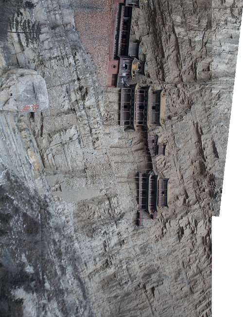
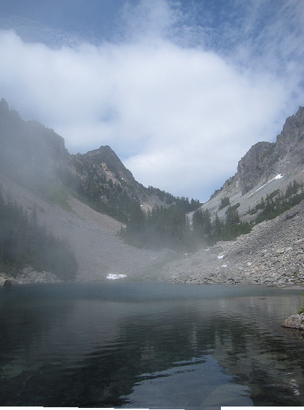
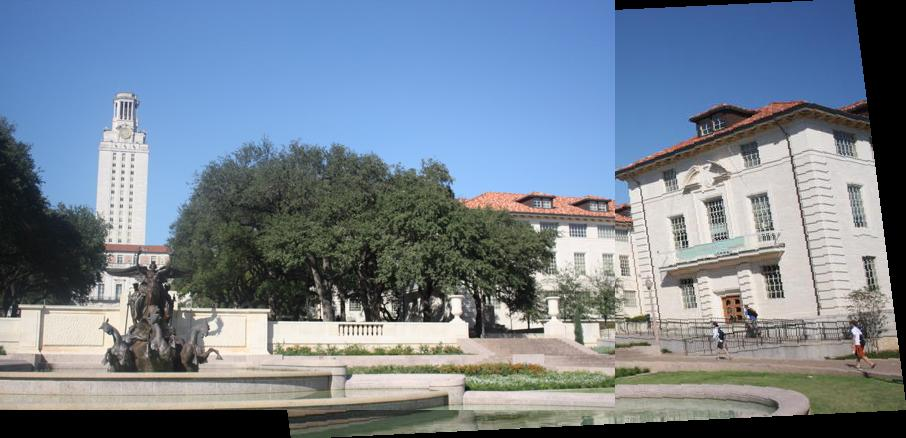
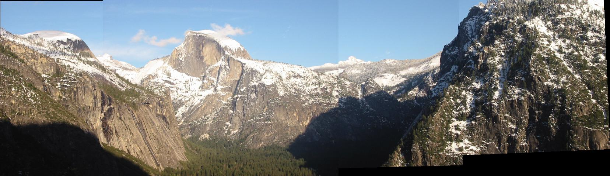
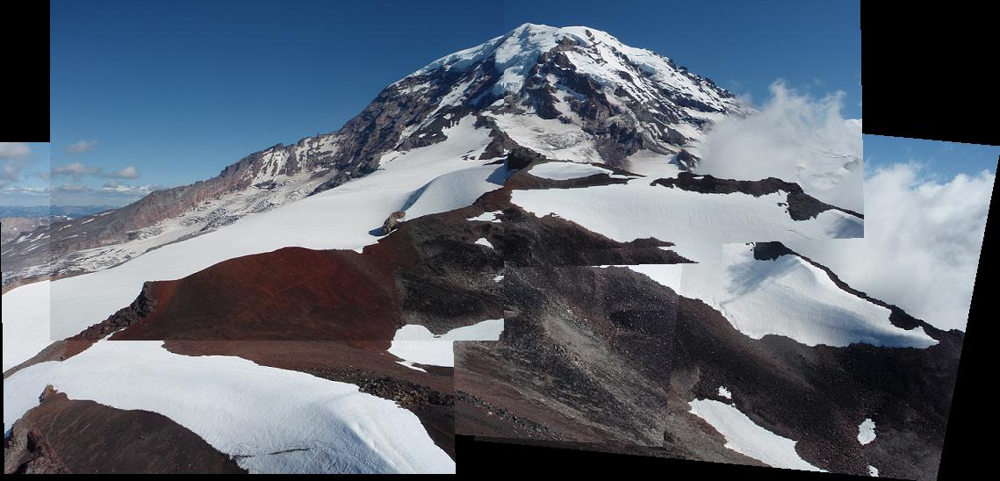
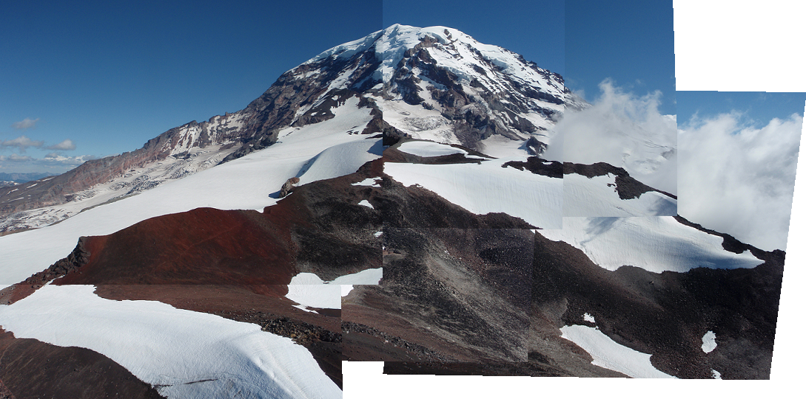
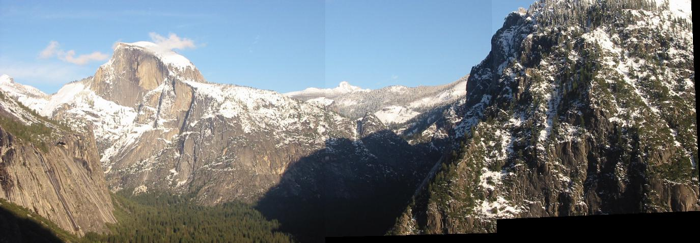

# Wei-Cheng Tseng <span style="color:red">104061146</span>

# Project 2 / Panorama Stitching

public repo: https://github.com/WeiChengTseng/NTHU-CV-hw2.git

## Overview
The assignment is related to Panorama stitching (image stitching). In this assignment, we complete simple SIFT function, SIFT detection, and match the SIFT points with several images. Finally, we are able to stitch images into a single panorma image.


## Implementation
1. Matching SIFT Descriptors
	* We use a for-loop to cheak whether a point in descriptor1 matches a point in descriptor2
		```python
		match = []
		N1, N2 = descriptor1.shape[0], descriptor2.shape[0]
		
		for i in range(N1):
	        diff = np.tile(descriptor1[i, :] , (N2,1)) - descriptor2
		    distance = np.sqrt(np.sum(np.square(diff), axis=1))
			
		    distance_order = np.sort(distance)
		    if distance_order[0] < distance_order[1] * THRESH:
		        match.append([i, np.argmin(distance)])
		```
2. Fitting the Transformation Matrix
	* Use `np.linalg.lstsq()` to calculate the solution of H*P1=P2 by first transpose both sides of equation.
		```python
		H = np.linalg.lstsq(P1.T, P2.T, rcond=None)[0].T
		```
3. RANSAC: ComputeError()
	* We extract the match points in pt1 and pt2. Afterward, we apply matrix multiplication of extracted points of pt1 and H. Then, calculate Euclidean Norm between the result and pt2 points.
		```python
		N = len(match)
		pt1 = [pt1[i, :] for i in match[:, 0]]
		pt2 = [pt2[i, :] for i in match[:, 1]]
		P1 = np.concatenate([pt1, np.ones([N, 1])], axis=1)
		P2 = np.concatenate([pt2, np.ones([N, 1])], axis=1)
		
		P1_transformed = np.matmul(P1, H.T)
		dists = np.sqrt(np.sum(np.square(P1_transformed - P2), axis=1))
		```

4. Stitching Multiple Images: makeTransformToReferenceFrame()
	* If currentFrameIndex is less than refFrameIndex. We continuously multiply each transformation matrix of adjacent frames as T.
	* If currentFrameIndex is larger than refFrameIndex We continuously multiply each inverse transformation matrix of previous adjacent frames as T.
	* If currentFrameIndex is equal to refFrameIndex, T is equal to identity matrix (`np.eye()`).
		```python
		T = np.eye(3)
		if currentFrameIndex < refFrameIndex:
		    for i in range(currentFrameIndex, refFrameIndex):
		        T = np.matmul(i_To_iPlusOne_Transform[i], T)
		elif currentFrameIndex > refFrameIndex:
		    for i in range(currentFrameIndex, refFrameIndex, -1):
		        T = np.matmul(np.linalg.pinv(i_To_iPlusOne_Transform[i-1]), T)
		elif (currentFrameIndex == refFrameIndex):
            T = np.eye(3)
		```
5. **Multiple Stitching regardless the order**
   * To create panoramic image regardless the order, we use a while-loop to continue create panoramic images from two images to all the images. At first, this solution consider only a pair of images. Then, we consider another image and create a new image. This cycle is repeated until we consider all the image. Please refer to `StitchTester_regardless_order.py`.

## Installation
* 3.6 python version is needed
* `cyvlfeat` package is needed

### Results
Stitching Two Images
<table border=1>
<tr>
<td>



</td>
</tr>

<tr>
<td>



</td>
</tr>

<tr>
<td>



</td>
</tr>
</table>

Stitching Multiple Images
<table border=1>
<tr>
<td>


</td>
</tr>

<tr>
<td>

</td>
</tr>

<tr>
<td>


</td>
</tr>

<tr>
<td>

</td>
</tr>

</table>

Regardless order
<table border=1>
<tr>
<td>

</td>
</tr>

<tr>
<td>

</td>
</tr>
</table>

## Discussion